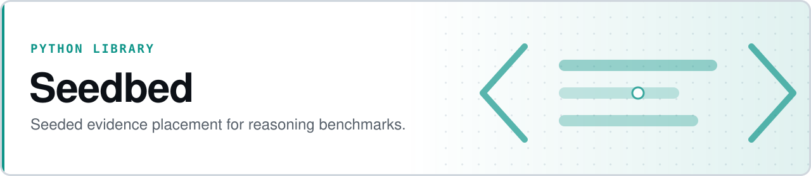

<p align="center">
  <picture>
    <source media="(prefers-color-scheme: dark)" srcset="assets/banner-dark.svg">
    
  </picture>
</p>

# Seedbed

**Generate reasoning benchmarks from a seed instead of hand-curating them.**

Seedbed scatters atomic claims across a graph of artifact slots so the reasoning chain is maximally tangled but provably recoverable. Borrowing assumed-fill from game randomizers, it guarantees every seed is solvable, verifies it cannot be shortcut, scores its difficulty, and emits a spoiler log.

- **Provably solvable, provably uncheatable** — every placement is verified by a reference solver, and no proper subset of the live route can recover the target
- **Reproducible *and* explicable** — same seed and tier give a byte-identical placement, and the log carries the whole search including undone branches and every RNG draw
- **Honest about its limits** — the guarantees section below states what is *not* guaranteed, with measurements
- **Pure and deterministic** — no LLM calls, no prose generation, no external services; stdlib only

[](https://github.com/safiqsindha/Seedbed/actions/workflows/tests.yml)


**[Module API](#using-it-as-a-module)** · **[Bundled worlds](#bundled-worlds)** · **[Guarantees](#what-is-and-isnt-guaranteed)** · **[Prior art](docs/PRIOR_ART_REPORT.md)** · **[Validation report](validation/REPORT.md)**

```bash
pip install -e .
seedbed --world toy --tier standard --seed 0    # prints a spoiler log as JSON
python -m pytest
```

See [`docs/PRIOR_ART_REPORT.md`](docs/PRIOR_ART_REPORT.md) for the randomizer prior art this borrows from and how its concepts map onto evidence placement.

## Using it as a module

`seedbed.api` is the supported surface. One call in, one frozen result out:

```python
from seedbed import generate, build_world

result = generate(build_world("toy"), tier="hard", seed=7)

result.placement            # claim id -> slot id (every claim placed)
result.live_route           # claims that actually carry the inference
result.stranded             # placed but not load-bearing: the decoys
result.recovery             # ordered inference steps, each with its slot path
result.difficulty           # score, with .difficulty_breakdown per term
result.solvable             # always True -- generate() raises otherwise
result.uncheatable          # likewise
result.spoiler(world)       # full audit trail, on demand
```

Bring your own world and address it by name:

```python
from seedbed import register_world, Claim, Slot, Actor, World, requires, either

register_world("mine", build_my_world)
result = generate(build_world("mine"), seed=0)
```

`generate()` raises `UnsolvableWorldError` when no legal placement exists and `SearchBudgetExceeded` when the search ran out of budget without deciding — different things, deliberately different types, both subclasses of `FillError`.

Rendering, prose, and LLM integration sit on the far side of this line by design (they are the project's stated non-goals). A renderer consumes a `GeneratedSeed`; it does not reach into the engine.

## Bundled worlds

Two hand-authored worlds, deliberately different in shape, so guarantees aren't statements about one topology:

- **`toy`** — 40 slots, 8 actors, 7 claims. Disjunction mid-chain, flat hierarchy.
- **`relay`** — 45 slots, 10 actors, 8 claims. Deeper chain, disjunction at the *target*, two-level reporting hierarchy, authority gates stacked along the chain.

The library itself is world-agnostic — any `World` with slots, actors, and claims works.

## Modules

- `model.py` -- `Actor`, `Claim`, `Slot`, `World`. A claim's `support` is a tuple of **alternative sufficient sets** (`requires(...)` for one conjunctive route, `either(...)` for several), so a conclusion can be established more than one way.
- `access.py` -- pluggable `AccessLogic` predicate (graph reachability + authority checks) and the `EASY`/`STANDARD`/`HARD` logic tiers.
- `fill.py` -- seeded assumed fill with **backtracking**: places claims into slots, exploring difficulty-maximizing candidates first and never placing a claim where two support alternatives are live. Records a full audit trail: every placement, backtrack, dead end and solution (`trace`), plus every draw taken from the seeded RNG (`rng_draws`).
- `solver.py` -- the solvability oracle: fixed-point recovery of which claims are inferable, and which are actually **load-bearing** (`SolveResult.live_route`).
- `cheat.py` -- cheatability check: confirms the solver fails on every proper subset of the *live route*.
- `difficulty.py` -- tunable difficulty scorer (hop count, authority reversals, distractor density, low-salience carrier fraction).
- `spoiler.py` / `cli.py` -- spoiler log assembly and the `seedbed` CLI.

`validation/` -- outside the library (see non-goals above): a recovery harness that renders a placement as structured facts for a solver-under-test, scores it against the reference solver, and correlates `difficulty` against recovery accuracy. See [`validation/REPORT.md`](validation/REPORT.md) for what it found.

## What is and isn't guaranteed

Worth reading before trusting a number out of this engine. Full detail, with
measurements, in [`docs/PRIOR_ART_REPORT.md` §6](docs/PRIOR_ART_REPORT.md).

**Guaranteed:**

- *Solvable.* Every placement the fill returns is verified by the reference solver.
- *Uncheatable.* No proper subset of the live route recovers the target. The fill prevents redundant support at placement time, so this is structural rather than a post-hoc filter.
- *Complete.* The fill fails only when no legal placement exists. Verified against an independent reference enumerator: 0 false negatives over 80 fillable worlds, 0 false positives over 40 impossible ones. `SearchBudgetExceeded` reports "don't know" separately from `UnsolvableWorldError`'s "proven impossible".
- *Reproducible, and explicable.* Same seed, same tier, byte-identical placement and spoiler log. The log carries the whole search — including the branches that were undone — and every RNG draw, so a run can be explained and not merely repeated.
- *Three distinct tiers.* `easy`/`standard`/`hard` are nested strictness settings of one predicate (`hard`'s edges are a strict subset of `standard`'s), and they diverge on most seeds rather than in name only.
- *Loud on pathology.* A support cycle, a claim no author may carry, or an unsatisfiable authority requirement raises immediately and names the claim at fault.
- *Works past toy scale.* Forward-checking (the randomizer discipline: never place an item without confirming the seed is still completable) fills 200 slots / 20-claim chains in ~1.6 s and 400 slots / 30 chains in ~7 s. Before it, a 60-slot world exhausted a 200k-node budget without finding a placement that trivially existed.
- *Monotone difficulty with tier strictness*, measured on one fixed placement scored under each tier — the axis the property is defined on. 0 violations / 88.
- *CI.* `.github/workflows/tests.yml` runs the suite on pytest across 3.10–3.12 on every push and PR.

**Not guaranteed:**

- *Globally maximal difficulty.* The fill returns the hardest complete placement it compared — a bounded best-of-N, now adaptive (stops after `improvement_patience` solutions without improvement, capped by `solution_limit`). `FillResult.solutions_compared` reports what was actually compared.
- *Monotone difficulty across independently generated placements.* Different tiers pick different support routes, so those totals describe different puzzles. That reading holds only 69/100 and is not claimed.
- *Calibrated weights.* `DEFAULT_WEIGHTS` are placeholders, not tuned against any real benchmark. A first attempt at validating them against actual recovery accuracy is in [`validation/REPORT.md`](validation/REPORT.md) — inconclusive on the two bundled worlds (a frontier model is near ceiling across their whole difficulty range), which is itself the finding: these worlds don't yet get hard enough to tell.
- *Unbounded scale.* Past a few hundred slots, `build_adjacency` is O(slots²) and dominates — 800 slots takes ~220 s while the search itself explores only ~630 nodes. That is a graph-construction cost, not a search problem. `validation/profile_adjacency.py` reconfirms the O(n²) shape on a synthetic world; the fix (bucket slots by team/thread/meeting/reporting line instead of an all-pairs scan) is identified but not implemented.

---

## Non-goals

Rendering, prose generation, and LLM integration sit deliberately outside the library. A renderer consumes a `GeneratedSeed`; it never reaches into the engine. `validation/` lives outside the library for the same reason.

## License

No license file is present in this repository. Contact the maintainer before reuse.
